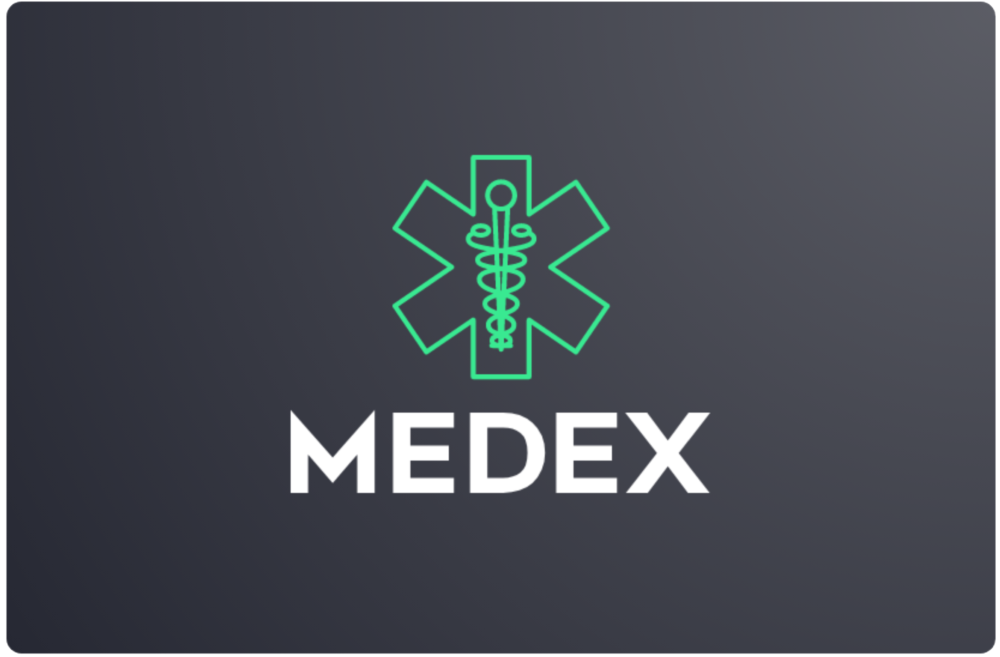

<div align="center">

     <h3 align="center">The Medex Software Suite</h3>
     <a href="https://www.java.com"></a>
     <a href="https://eclipse-ee4j.github.io/jersey"></a>
     <a href="https://tomcat.apache.org"></a>
     <a href="https://aws.amazon.com"></a>
     <a href="https://www.mysql.com"></a>
     <a href="https://www.eclipse.org/ide"></a>

</div> 
<hr>
<div align="center">
    
  <h3 align="center">Shopping Microservice</h3>
</div>

## :shopping_cart: About The Microservice
This microservice is responsible for handling the processes which patients using Medex would utilize. Those include:
- Viewing prescriptions
- Viewing cart
- Modifying cart item amounts
- Removing items from cart
- Specifying delivery location and making an order by paying for the cart items
- Viewing orders
- Refunding orders that are currently in progress
- Viewing the list of pharmacies
- Viewing the pharmaceuticals available in each pharmacy and adding to cart
<div align="center">
    
     <p>The Android UX used to access the microservice's capabilities</p>
</div>


## :compass: Some Endpoint Examples (RESTful APIs)
```
GET:
     /patients
     /patients/<patient_id>
     /patients/<patient_id>/orders
     /patients/<patient_id>/orders/<order_id>
     /patients/<patient_id>/orders/<order_id>/orderItems
     /patients/<patient_id>/orders/<order_id>/orderItems/<orderItem_id>
     /patients/<patient_id>/cartItems
     /patients/<patient_id>/cartItems/<cartItem_id>
     /patients/<patient_id>/prescriptions
     /patients/<patient_id>/prescriptions/<prescription_id>
     /pharmacies/
     /patients/<pharmacy_id>/pharmaceuticalsStock
     /patients/<pharmacy_id>/pharmaceuticalsStock/<pharmaceuticalStock_id>
POST:
     /patients
     /patients/<patient_id>
     /patients/<patient_id>/pay
     /patients/<patient_id>/orders
     /patients/<patient_id>/cartItems
     /patients/<patient_id>/orders/<order_id>/orderItems
     /pharmacies/<pharmacy_id>/pharmaceuticalsStock

PUT:
     /patients/<patient_id>
     /patients/<patient_id>/orders/<order_id>
     /patients/<patient_id>/orders/<order_id>/orderItems/<orderItem_id>
     /patients/<patient_id>/cartItems/<cartItem_id>
     /patients/<pharmacy_id>/pharmaceuticalsStock/<pharmaceuticalStock_id>
DELETE:
     /patients/<patient_id>
     /patients/<patient_id>/orders/<order_id>
     /patients/<patient_id>/orders/<order_id>/refund
     /patients/<patient_id>/orders/<order_id>/orderItems/<orderItem_id>
     /patients/<patient_id>/cartItems/<cartItem_id>
```

There exist excess fully functional endpoints.  

<hr>
<div align="center">
  <h4>Shared sections are common among all the Medex microservice repositories</h4>
</div>
<hr>

## :hospital: Shared - About Medex
A group project full stack application that utilizes Android Studio, Java Jersey, MySQL, and AWS.  
The goal of the project was to acquire more experience in utilizing HTTP requests & RESTful APIs, microservice architecture, and high-availability AWS deployments.  
<br>
The premise behind Medex is to connect doctors, patients, couriers and pharmacies with one another such that patients can use e-prescriptions provided by their doctors to order pharmaceuticals, which are delivered from the pharmacies to the patient through a courier.  
<br>
More precisely, here are the requirements of Medex:
- [x] <b>Register and Login</b>  
          Patients, doctors, personnel and pharmacies can register and login to Medex, giving them access to their dedicated UX on the Android app  
- [x] <b>Patients can interact with pharmacy and medicine catalogs</b>  
          Patients can view the catalog of pharmacies, the medicine in each pharmacy, and add medicine to cart 
- [x] <b>Patients can pay for their carts</b>  
          Patients can use their "wallets" to pay for the contents of their carts, automatically consuming their prescriptions and funds in the process
- [x] <b>Patients can view their prescriptions</b>  
          Patients are able to check their prescriptions and how many times each prescription can be used
- [x] <b>Patients can interact with their orders</b>  
          Patients can view their orders and the order items along with modifying the items, and refunding their orders 
- [x] <b>Personnel can assign an order to themselves</b>  
          Personnel can choose to assign an order to themselves; the orders are assigned on a first-come-first-serve (FCFS)
- [x] <b>Personnel can utilize maps to find the location of their assigned order</b>  
          Personnel would have access to maps, displaying the location they should deliver to
- [x] <b>Personnel can mark orders as done</b>  
          Once a delivery is made, the personnel can mark their current order as done
- [x] <b>Pharmacies can add medicine to the global medicine database</b>  
          Pharmacies can add newly acquired medicine in the market that can be used by all pharmacies 
- [x] <b>Pharmacies can view and manage their stock</b>  
          Pharmacies have their own stock which is a subset of the global medicine database which they can modify in terms of quantity, and pricing
- [x] <b>Doctors can view and manage their patients</b>  
          Every doctor has a list of patients which is a subset of the list of patients using Medex, the doctors can assign and unassign patients to themselves
- [x] <b>Doctors can view and manage the prescriptions of their patients</b>  
          Doctors can assign, modify and revoke the prescriptions of patients  
- [x] <b>Doctors can view the global medicine database</b>  
          The doctors are able to view the medicine available and assign them to the patients accordingly  


## Shared - Microservices

#### Microservices
Rather than building a single monolithic application, Medex utilizes the microservice architecture which helps with availability since if a microservice goes down, say the doctors', then other microservices can continue functioning normally as they are decoupled.  
Updating microservices is also a less tedious process than updating a monolithic program where changes to a service are more likely to lead to side effects in another service within the program.
<br>
<div align="center">
<h4>An example of microservice architecture within Medex</h4>

</div>
Within a microservice, there also exist different layers:  

- Resource  
- Service  
- Database  

This makes it such that the implementation (Service) of an exposed endpoint (Resource) can be changed without affecting how the API is seen by the outside world (Exact same HTTP request regardless of implementation).


## :flight_departure: Shared (Except repo URL) - How To Run
#### Multi-platform:
1. Install [Eclipse Enterprise](https://www.eclipse.org/downloads/packages/release/2021-06/r/eclipse-ide-enterprise-java-and-web-developers) on your computer  
2. In Eclipse, go to Help --> Install New Software --> In "work with", paste `https://download.eclipse.org/egit/updates` --> Select the git packages --> Wait for installation to finish
3. Open Eclipse preferences, filter with `git`, go to configurations, add 2 entries:
     ```  
     Key: email, Value: <Your GitHub Email>  
     
     Key: name, Value: <Your GitHub Username>  
     ```
4. File --> Import --> Git --> Project from Git --> Clone URL -->  
    URL: `https://github.com/ElixirForge/medex-shopping-microservice.git`  
    connection: `https`  
    authentication: `your details`   
5. Wait till Eclipse finishes building the project  
6. Modify `<release>15</release>` in `pom.xml` to `<release>11</release>`. And in Eclipse's preferences, in "compiler", make sure to use Java 11 compiler compliance level  
7. In `/src/main/java/com/medex/database/HibernateUtil.java`, modify all the `URL`, `USER`, and `PASS` values to where you have your database schemas hosted  
     - You will notice `getDoctorSessionFactory()`, `getPharmacySessionFactory()`, `getShoppingSessionFactory()`, `getPersonnelSessionFactory()` functions within `HibernatureUtil.java` (Not necessarily do all those functions exist in every microservice)  
     - Each function is responsible for creating one database connector. And each database connector is responsible for one schema
     - The `URL` in each function would take a string that looks like `jdbc:mysql://<some name>.<XXXXXXX.AWS-region>rds.amazonaws.com/<SchemaName>`  
          - For example, for `getDoctorSessionFactory()` the <SchemaName> would be `DoctorMicroserviceSchema` while for `getPharmacySessionFactory` the <SchemaName> would be `PharmacyMicroserviceSchema`, and so on
     - So, you would have multiple MySQL schemas hosted on the same server, but each schema would require a dedicated connector
     - Assuming you use the provided SQL code, just make sure to modify <some name> & <XXXXXXX.AWS-region> to your hosted server; the schema names will take care of themselves.
8. Run the project --> Server on localhost --> Tomcat 9.0 --> Install tomcat 9.0.46 in a directory --> Choose the directory --> Run  
9. Note that every endpoint must be written in the following manner: `<host>:<port>/LoginMicroservice/webapi/<Your Endpoint>`  
     - The `LoginMicroservice` part should be changed so that you can run the multiple microservices simultaneously  
     - By this point, you should have this directory in your Eclipse file explorer: `Servers/apache-tomcat-9.0.46 at localhost-config`. There is a file called `server.xml`, change the `path` that is inside the `context` tag to whatever you would like instead of `LoginMicroservice`  
10. If you made any modifications in step 9 then run the microservice again
11. Use your web browser or postman to test endpoints  
   


<div>
<h2><a href="https://aws.amazon.com"></a> Shared - Deployment</h2>
While deployment can be done on any platform, AWS was the chosen platform for Medex's deployment during the project.  
</div>
     
#### Simple Deployment
1. In Eclipse: File --> Export --> Web --> WAR file. Wait for the export to finish  
2. Login to AWS, search for elastic beanstalk, create a TomCat 9.0 environment and upload the WAR file  
3. Make sure the elastic beanstalk instance is up and running successfully (The UX on AWS will inform you if that is not the case)  
4. Make sure the VPC you have your Elastic Beanstalk Instance hosted in is configured appropriately (Along with its gateway, access control lists, and security groups) to allow for access from the web  

#### Recommended Deployment & Node Architecture
Medex is split into numerous microservices due to the advantages of a microservice implementation. However, this can be improved further through hosting each microservice in different regions simultaneously. The recommended deployment would be as follows:  

<br>
<div align="center">

</div>

When the Android application sends an HTTP request using Volley, it would be sent to a load balancer which decides which instance of the microservice to direct the HTTP request to.  
<br>
Assuming 3 regions are being utilized, with 1 instance only running in each region, there would be a total of  
`4 microservices * 3 regions/microservice * 1 instance/region = 12 instances`  which would greatly aid in keeping Medex available.

<h2><a href="https://www.mysql.com"></a> Shared - SQL Database Schema</h2>
  <div align="center">
   

  </div>
     
#### Comments on the database 
- `Ordr` was used since `Order` is a reserved keyword  
- MySQL was used because it supports foreign keys accross different schemas; hence supporting the microservice architecture. More on this in the "Important" section
- For the sake of the project, a form of pseudo-authentication was used instead of tokens, however they are simply implementable. Same goes for hashing passwords
     
#### Database deployment
- You can host the database anywhere you would like, but AWS's relational database service (RDS) was used in the project  
- Simply use a free-tier MySQL RDS instance, connect to it with MySQL Workbench, create the schemas there, and populate them as necessary
- Make sure your RDS is configured such that it is <i>only accessible</i> from the microservices. Your RDS being accessible from the internet poses a security risk
     
#### Important
- Typically, a microservice must have dedicated database just for it. In the implementation of Medex, there is only one database mith multiple schemas that are interconnected using foreign keys  
- It could be argued that this defeats the purpose of microservices since there is tight coupling happening in the database layer; so if the database goes down, so do the capabilites of all the microservices relying on said database
- However, there is some data that multiple microservices need to access due the initial design of the project and therefore, if one were to completely decouple the schemas into different databases hosted separately, the microservices would have to do API calls to each other to access each other's databases; this means that there are two points of failure now: The microservice (Since microservice A would not be able to make API calls from microservice B if microservice B goes down) & the multiple databases  
- The solution of having one hosted database that all microservices access directly makes that database a critical single point-of-failure
- The way to remove this single point-of-failure would be through redundant deployment such that a database would have a replica ready at any point in time in case of a failure. This way, the microservice architecture's pros are achieved successfully, albeit in an unorthodox manner
